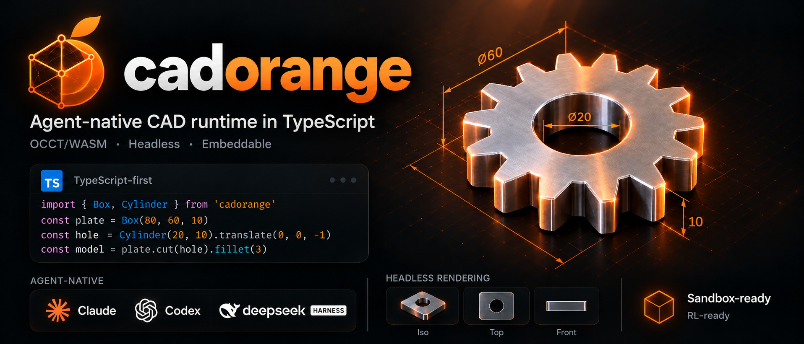

<p align="center">
  
</p>

<h1 align="center">cadorange</h1>

<p align="center">
  <b>Agent-native CAD runtime in TypeScript, powered by occt.ts (OCCT/WASM).</b><br/>
  Headless · Embeddable · Zero Python · Just <code>npm i</code>
</p>

<p align="center">
  <a href="https://www.npmjs.com/package/cadorange"></a>
  <a href="./LICENSE"></a>
  <a href="https://github.com/LAU-MARS/cadorange/actions/workflows/ci.yml"></a>
</p>

<p align="center">
  English | <a href="./README.zh-CN.md">简体中文</a>
</p>

## What is cadorange?

cadorange is a code-CAD kernel and runtime built for AI agents. It runs anywhere JavaScript runs, including Node, Bun, Deno, browsers, Web Workers and sandboxes. It gives agents a real B-Rep CAD engine (OpenCASCADE, compiled to WASM via occt.ts), along with the runtime features agents need:

- **Snapshots, forks and rollback.** Every model is an operation log, so you can try a change, inspect the result and roll back if it fails.
- **Structured errors.** Failures are returned as JSON with the failing op, a reason and a suggested fix. You don't have to parse an OCCT stack trace.
- **Headless rendering.** Multi-view PNG/SVG renders without a GPU or a browser window, so vision models can check their own work.
- **Deterministic output.** The same code produces the same geometry, hashes and renders. This makes it suitable for evals and RL.
- **Introspection.** `describe()` returns volumes, bounding boxes, face and edge counts and topology summaries as plain JSON.
- **Embeddable.** It runs in-process, with no Python, no conda, no subprocess and no server required.

It works as a plain library, as a CLI (`cado`) or as an MCP server. That means it can plug into Claude Code, Codex, dsh and any other MCP-capable agent.

## Quick start

### As a library

```bash
npm i cadorange
```

```ts
import { init, Box, Cylinder, Axis, fillet } from "cadorange";

await init(); // loads the OCCT WASM kernel once

const plate = Box(80, 60, 10);
const hole = Cylinder({ radius: 8, height: 10 });

let part = plate.cut(hole);
part = fillet(part.edges().filterBy(Axis.Z), 3);

console.log(part.describe());
// { volume: 45912.12, bbox: [80, 60, 10], faces: 11, edges: 27, valid: true }

await part.export("plate.step");
await part.export("plate.stl", { tolerance: 0.05 });
```

### CadQuery-style fluent API

```ts
import { Workplane } from "cadorange/workplane";

const part = new Workplane("XY")
  .box(80, 60, 10)
  .faces(">Z").workplane()
  .hole(16)
  .edges("|Z").fillet(3);
```

### As an MCP server

**Claude Code**

```bash
claude mcp add cadorange -- npx -y @cadorange/mcp
```

**Codex (`~/.codex/config.toml`)**

```toml
[mcp_servers.cadorange]
command = "npx"
args = ["-y", "@cadorange/mcp"]
```

**dsh**

dsh ships with cadorange support. Add it as an MCP server in dsh's settings:

```json
{
  "mcpServers": {
    "cadorange": { "command": "npx", "args": ["-y", "@cadorange/mcp"] }
  }
}
```

**Any MCP client**

```json
{
  "mcpServers": {
    "cadorange": { "command": "npx", "args": ["-y", "@cadorange/mcp"] }
  }
}
```

### As a CLI

```bash
npx cado run model.ts --render iso,top,front --export step,stl
npx cado describe model.ts --json
```

### The agent runtime

```ts
import { Session } from "@cadorange/runtime";

const s = await Session.create({ limits: { timeoutMs: 10_000, memoryMB: 512 } });

const r1 = await s.run(`const p = Box(80, 60, 10); export default p;`);
const base = s.snapshot();               // cheap: op log + cached shapes

const r2 = await s.run(`export default fillet(p.edges(), 40);`);
if (!r2.ok) {
  console.log(r2.error);
  // {
  //   code: "FILLET_RADIUS_TOO_LARGE",
  //   op: { id: 3, type: "fillet", args: { radius: 40 } },
  //   message: "Fillet radius 40 exceeds the max feasible radius (~5) for 12 edges.",
  //   hint: "Try radius <= 4.9, or fillet a subset: p.edges().filterBy(Axis.Z)"
  // }
  s.rollback(base);
}

const views = await s.render({ views: ["iso", "top", "front"], size: 512 }); // PNG buffers
```

| Capability | API |
| --- | --- |
| Run code / ops | `session.run(code)` · `session.apply(op)` |
| Snapshot / fork / rollback | `snapshot()` · `fork(snap)` · `rollback(snap)` |
| Inspect | `describe()` · `diff(snapA, snapB)` |
| Render | `render({ views, size, format })` |
| Export | `export("step" \| "stl" \| "glb" \| "brep")` |
| Limits | timeout, memory and op-count limits for each session |

## Packages

| Package | Description |
| --- | --- |
| `cadorange` | Core modeling API: shapes, selectors, booleans, features, import/export |
| `@cadorange/runtime` | Session, op log, snapshots, structured errors, sandboxed execution |
| `@cadorange/render` | Headless multi-view rendering (PNG/SVG) |
| `@cadorange/mcp` | MCP server and the `cado` CLI |

## Why TypeScript?

- **Zero-install for agents.** `npx` is enough. You don't have to manage a Python env, conda or wheels.
- **Runs in the browser.** The same kernel can power web CAD apps, playgrounds and client-side previews.
- **Typed API = better agent feedback.** Type errors show up before the geometry ever runs.
- **In-process and embeddable.** It fits into Node/Bun agents, VS Code extensions, Electron apps and edge sandboxes.

## Relationship to build123d and CadQuery

cadorange is inspired by [build123d](https://github.com/gumyr/build123d) and [CadQuery](https://github.com/CadQuery/cadquery). We think they are the best code-CAD APIs available, and LLMs already know them well.

- The core API follows build123d's explicit object model (`Box`, `Cylinder`, `fillet`, `Axis`, `ShapeList.filterBy/groupBy/sortBy`). Python operator overloading (`a - b`) becomes methods (`a.cut(b)`).
- `cadorange/workplane` provides a thin CadQuery-style fluent facade with string selectors (`">Z"`, `"|Z"`).
- Names are converted to camelCase (`filter_by` → `filterBy`). A migration table lists the differences.
- cadorange is an independent project and is not affiliated with either one.

## Roadmap

- [ ] **M0: walking skeleton.** Box, cylinder, booleans, fillet/chamfer, basic selectors, op log and rollback, STEP/STL export, iso PNG render, MCP in Claude Code, Node and browser both working
- [ ] **M1: sketch and features.** 2D sketches, extrude, revolve, loft, sweep, shell, holes, patterns
- [ ] **M2: the agent loop.** Structured error catalog, describe/diff, multi-view render, sandbox limits, CADGenBench integration
- [ ] **M3: breadth.** Coverage of the API LLMs use most often, driven by benchmark results; the Workplane facade; docs
- [ ] **M4: RL-ready.** Deterministic op-level environment, reward hooks (validity, volume/IoU and render similarity), batch rollouts

## Development

```bash
pnpm i
pnpm build
pnpm test           # vitest (node)
pnpm test:browser   # vitest browser mode
```

See [CONTRIBUTING.md](./CONTRIBUTING.md).

## License

Apache-2.0. OpenCASCADE Technology is licensed under LGPL-2.1 with an exception. See [NOTICE](./NOTICE).
